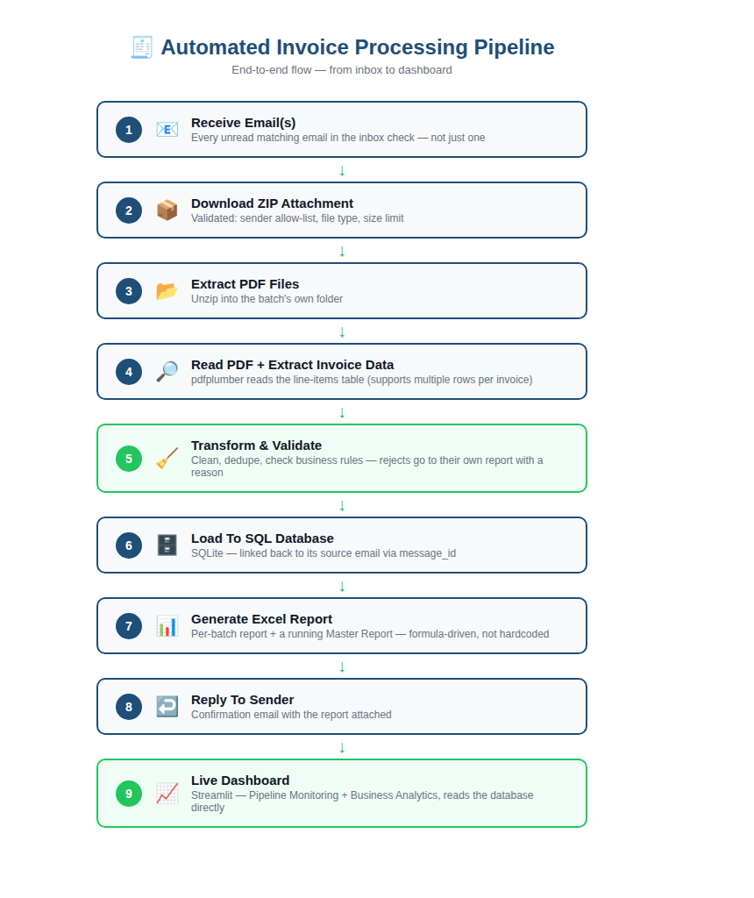

# 📄 Automated Invoice Processing Pipeline

An end-to-end data engineering pipeline that receives supplier invoices by
email as a ZIP of PDFs, extracts and validates the data, loads it into a
SQL database, generates Excel reports, replies to the sender
automatically, and exposes both pipeline health and business metrics
through a live dashboard.

> Status: ✅ Complete — built step by step, module by module, and verified end-to-end.

## Business Scenario

A company receives supplier invoices by email instead of entering them
manually. This pipeline automates the entire process:

1. Invoices arrive by email — possibly from several suppliers on the same day
2. Required fields are extracted from each PDF
3. Data is validated and stored in a SQL database
4. An Excel report is generated for each batch, plus a running master report
5. The sender receives an automatic confirmation reply
6. Results are visualized on a live dashboard

## Pipeline Flow

```
Receive Email(s)
   -> Download ZIP Attachment
      -> Extract PDF Files
         -> Read PDF Content
            -> Extract Invoice Data
               -> Transform & Clean Data
                  -> Load To SQL Database
                     -> Generate Excel Report (per batch + master)
                        -> Reply To Original Sender
                           -> Update Dashboard
```



If several unread invoice emails are found in the same inbox check (e.g.
three different suppliers emailed invoices the same day), **every one of
them is processed in that same run** — each gets its own pipeline run,
its own report, and its own reply.

## Architecture / Modules

| Module                | Responsibility                                                              |
|------------------------|------------------------------------------------------------------------------|
| `email_service`        | Monitor inbox, read & validate emails, download ZIP attachments, send replies |
| `pdf_engine`            | Read PDF content, extract invoice fields (supports multi-line-item invoices) |
| `data_transformation`   | Clean data (nulls, duplicates), validate business rules, build transport records |
| `sql_engine`            | Insert invoice/email/rejection records, read analytics data from SQLite      |
| `report_engine`         | Generate Excel reports (per-batch + running master report)                   |
| `dashboard`             | Pipeline monitoring + business analytics (Streamlit)                         |
| `tools`                 | `generate_sample_invoices.py` (builds test ZIPs) + `run_all_samples.py` (runs every ZIP in `sample_data/` in one go) |

## Tech Stack

- **Python** — pipeline logic and automation
- **pdfplumber** — PDF table/text extraction
- **SQLite** — invoice database
- **openpyxl** — Excel report generation (formula-driven, not hardcoded values)
- **Streamlit + Plotly + streamlit-autorefresh** — live-updating dashboard
- **imaplib / smtplib** (standard library) — email read & reply

## Invoice Format Supported

Each invoice PDF is expected to have its line item(s) in a **table** with
these column headers: `Category | Product | Quantity | Unit Price | Total
Amount`. One invoice can have multiple line items (multiple rows). Header
fields (Invoice No, Invoice Date, Bill To/Customer Name, Country) are read
as plain "Label: Value" lines above the table.

A PDF with no such table (free-text only, no line-item table) is rejected
with a clear reason in the Rejected Invoices report — this is intentional,
not a bug, since there'd be no reliable product/quantity/price data to
extract.

## Project Structure

```
invoice-processing-pipeline/
│
├── attachments/          # Downloaded ZIP files land here (Email Mode)
├── extracted_pdfs/       # PDFs extracted from each ZIP, one subfolder per batch
├── reports/              # Generated Excel reports (per-batch + Master_Invoice_Report.xlsx)
├── logs/                 # Daily pipeline run logs
├── sample_data/          # Sample invoice ZIPs for Local/Test Mode
├── tools/
│   ├── generate_sample_invoices.py   # Generates the sample ZIPs above
│   └── run_all_samples.py            # Runs every ZIP in sample_data/ in one go
├── dashboard/             # Streamlit dashboard app
│   ├── app.py
│   ├── monitoring_section.py
│   └── business_section.py
├── email_service/         # Inbox monitor, reader, ZIP extraction, reply sender
├── pdf_engine/             # PDF reading + field extraction (multi-line-item support)
├── data_transformation/    # Cleaning, dedup, data-quality validation
├── sql_engine/             # Database write layer + analytics queries
├── report_engine/          # Excel report generation
├── database/
│   └── schema.sql           # invoice_data / email_processing_log / rejected_records / pipeline_runs / pipeline_activity_log
├── config.py                 # Central configuration (reads .env)
├── logger_config.py          # Shared logger
├── main.py                   # Pipeline orchestrator (entry point / CLI)
├── requirements.txt
├── .env.example
└── README.md
```

## Database Schema

**`invoice_data`** — one row per invoice line item:

| Column            | Type    | Notes                                   |
|-------------------|---------|------------------------------------------|
| invoice_no        | TEXT    |                                          |
| message_id        | TEXT    | links back to `email_processing_log`    |
| source_batch      | TEXT    | which ZIP/batch this came from          |
| invoice_date      | TEXT    |                                          |
| customer_name     | TEXT    |                                          |
| product_category  | TEXT    |                                          |
| product_name      | TEXT    |                                          |
| quantity          | REAL    |                                          |
| unit_price        | REAL    |                                          |
| total_amount      | REAL    |                                          |
| country           | TEXT    |                                          |
| created_date      | TEXT    | optional, from the PDF itself if present |
| record_status     | TEXT    | 'VALID' (rejected lines go to `rejected_records` instead) |
| rejection_reason  | TEXT    |                                          |

**Other tables:**

| Table                     | Purpose                                                      |
|----------------------------|----------------------------------------------------------------|
| `email_processing_log`     | One row per email seen (SUCCESS/REJECTED + reason) — feeds the "Email Processing" dashboard section |
| `rejected_records`         | Every invoice line that failed parsing/validation, with its reason |
| `pipeline_runs`             | One row per batch run (start/end time, status, counts) — feeds "Pipeline History" |
| `pipeline_activity_log`     | Step-by-step events within a run — feeds "Recent Activity" |

## Setup

```bash
git clone https://github.com/bahaalashin-data/invoice-processing-pipeline.git
cd invoice-processing-pipeline
python -m venv venv
venv\Scripts\activate        # Windows
pip install -r requirements.txt
copy .env.example .env
```

This gets Local/Test Mode (`--source local`) working right away with no
further setup — see **Running** below. Email Mode (`--source email`)
needs one more step first:

### Connecting your own email account

The pipeline reads invoices via IMAP and replies via SMTP, so it needs
real mailbox credentials in `.env`. For a Gmail account:

1. Turn on **2-Step Verification** on the Google account
   (myaccount.google.com/security).
2. Under the same Security page, open **App passwords** and create one
   for this project (any name works, e.g. "Invoice Pipeline"). Google
   gives you a 16-character password — copy it.
3. In `.env`, set:
   ```
   EMAIL_ADDRESS=your_email@gmail.com
   EMAIL_PASSWORD=the_16_character_app_password   # not your normal Gmail password
   IMAP_SUBJECT_FILTER=Invoices                   # must match the subject suppliers use
   ```
4. Using a different provider (Outlook, a company mailbox, etc.)? Set
   `IMAP_HOST` / `SMTP_HOST` in `.env` to that provider's IMAP/SMTP
   server address instead, and generate an app-specific password the
   same way if the provider requires one.

`REPORT_RECIPIENT_EMAIL` and `REPORT_CC_EMAILS` are optional — leave
them blank to just reply to whoever sent the invoice email.

## Why SQLite?

SQLite was chosen for zero-config portability: no server, no credentials,
no Docker — the database is a single file that's created automatically
on first run, which matters for anyone cloning this repo and trying it
in Local/Test Mode. The data-access layer (`sql_engine`) is isolated
from the rest of the pipeline, so swapping to PostgreSQL later would
only require changing the connection layer, not the pipeline logic.

## Running

**Local / Test Mode** (no email setup needed — great for a first run):
```bash
python main.py --source local --zip sample_data/Invoices_June.zip
```
Other ready-made batches: `Invoices_August.zip`, `Invoices_September.zip`,
`Invoices_October.zip`, `Invoices_March.zip` (the March batch includes a
multi-line-item invoice). Regenerate or add more with:
```bash
python tools/generate_sample_invoices.py
```

**Run all sample batches at once** (loads every ZIP in `sample_data/`
in one go, instead of running the command above once per file):
```bash
python tools/run_all_samples.py
```

**Production Mode** — connects to the real inbox once and processes
*every* unread matching email found in that check (not just one):
```bash
python main.py --source email
```

**Production Mode, watching the inbox continuously:**
```bash
python main.py --source email --watch
```

**Optional flags:**
- `--send-email` — in Local Mode, also send the completion email (needs `REPORT_RECIPIENT_EMAIL` in `.env`, or `--to`)
- `--to someone@example.com` — override the recipient for this run

**Dashboard:**
```bash
streamlit run dashboard/app.py
```

## Roadmap

- [x] Project skeleton, config, logging, schema
- [x] `email_service`: inbox monitor, sender allow-list, attachment validation, ZIP download, reply sender (with CC support)
- [x] `pdf_engine`: table-based invoice parsing, including multi-line-item invoices
- [x] `data_transformation`: cleaning, deduplication, data-quality validation
- [x] `sql_engine`: SQLite load + dashboard analytics queries
- [x] `report_engine`: per-batch Excel report + running Master Report (formula-driven)
- [x] `dashboard`: Streamlit app — Pipeline Monitoring + Business Analytics tabs, light theme
- [x] **Multi-email support**: every unread matching email in one inbox check is processed in the same run, each with its own report and reply
- [x] Invoice-to-email traceability via `message_id`
- [x] End-to-end tested with multiple real batches (verified working)

## Author

**Bahaa Lashin** — built as a portfolio project demonstrating skills in
Python automation, data extraction/validation, SQL, and
reporting/dashboarding.

Developed with the help of Claude (Anthropic) as an AI pair-programmer —
used for scaffolding modules, debugging, and reviewing design decisions
throughout the build.